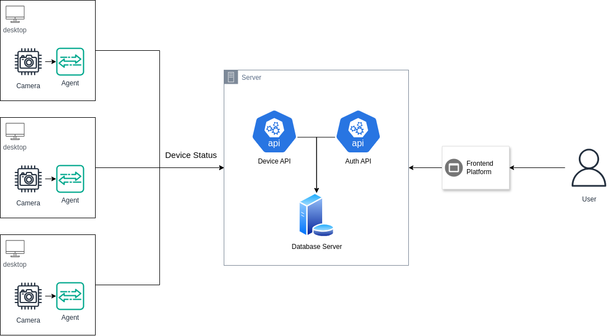

# CamWatch

## Overview

**CamWatch** is a centralized camera monitoring and management system. It offers a user-friendly interface for managing devices and viewing their statuses.

## Architecture

The system is designed with a multi-tier architecture composed of the following components:

- **Frontend**: HTML, CSS, JavaScript
- **Backend**: Java with Spring Framework
- **Database**: PostgreSQL
- **Agent**: Python

### Frontend
The frontend is built using HTML, CSS, and JavaScript. It provides an intuitive interface for users to interact with the system. The main features include:

- **Dashboard**: Displays a list of devices, their statuses, and other relevant information.
- **User Management**: Manages user sessions and authentication.
- **Responsive Design**: Ensures compatibility across various devices and screen sizes.

#### Technologies Used
- **HTML5**: For structuring web pages.
- **CSS3**: For styling the user interface.
- **JavaScript**: Enables dynamic functionalities.

### Backend
The backend is developed using Java with the Spring Framework. It handles business logic, database interactions, and communication with the frontend. The backend also provides APIs for interaction with the agent.

#### Key Features
- **RESTful APIs**: Exposes endpoints for device management, user authentication, and more.
- **Spring Boot**: Simplifies application setup with embedded server support.
- **Security**: Integrated with Spring Security to manage authentication and authorization.

### Database
CamWatch uses PostgreSQL as its primary database management system. It stores information about users, devices, and their statuses.

#### Key Aspects
- **Schema Design**: Optimized for fast retrieval and efficient storage of device data.
- **UUID**: Used for unique identification of records.
- **Transactions**: Ensure data integrity and consistency.

### Agent
The CamWatch agent is a Python script that runs on devices to collect and send data back to the server. It is responsible for:

- **Device Registration**: Registers the device with the CamWatch server.
- **Status Monitoring**: Periodically checks the device’s status and reports it to the server.

#### Technologies Used
- **Python 3.x**: The primary language used for agent development.
- **Requests Library**: For making HTTP requests to the CamWatch server.
- **JSON**: For data serialization and communication with the backend.
